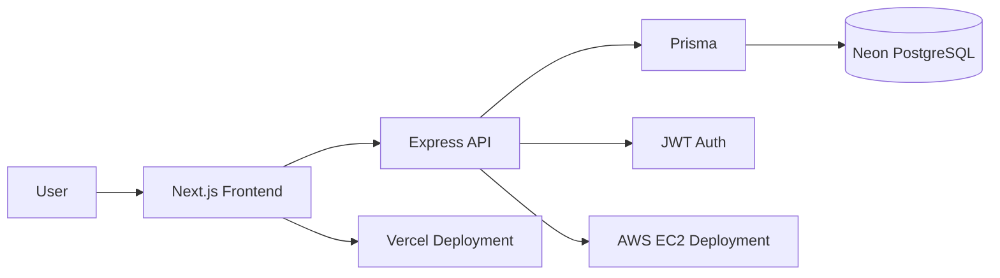
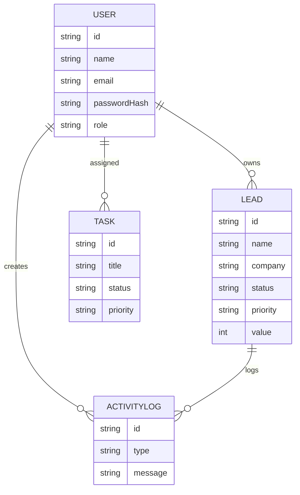

# HR CRM

HR CRM is a modern CRM SaaS starter built to look like a real startup product while staying easy to explain in interviews.

## What it includes

- Next.js 15 frontend with TypeScript, Tailwind CSS, custom glassmorphism components, and Framer Motion animations
- Express.js backend with JWT authentication, refresh token rotation, and Zod validation
- Prisma ORM for PostgreSQL on Neon
- Full CRUD for leads and tasks — all pages connected to the real API
- Dashboard, leads, tasks, profile, analytics, and settings screens
- Search, filtering, pagination, protected routes, dark mode, light mode, toast feedback, and command palette (Ctrl+K)

## Architecture



## Folder Structure

### Frontend

- `frontend/app` - routes, layouts, and pages
- `frontend/components` - reusable UI and feature components
- `frontend/hooks` - theme and toast hooks
- `frontend/services` - API wrappers
- `frontend/utils` - types and helpers

### Backend

- `backend/src/controllers` - HTTP handlers
- `backend/src/routes` - route definitions
- `backend/src/services` - business logic
- `backend/src/middleware` - auth, validation, and error handling
- `backend/src/config` - env and Prisma client setup
- `backend/src/models` - Zod schemas and shared DTOs

## Database Schema

Core tables:

- `User`
- `Lead`
- `Task`
- `ActivityLog`

### ER Diagram



## API Documentation

Base URL: `https://your-backend-domain.com/api`

### Auth

- `POST /auth/signup`
- `POST /auth/login`
- `POST /auth/refresh`
- `GET /auth/me`
- `PATCH /auth/change-password`

### Leads

- `GET /leads`
- `POST /leads`
- `PUT /leads/:id`
- `DELETE /leads/:id`

### Tasks

- `GET /tasks`
- `POST /tasks`
- `PUT /tasks/:id`
- `PATCH /tasks/:id/complete`
- `DELETE /tasks/:id`

### Dashboard

- `GET /dashboard/summary`

### Profile

- `GET /profile/me`
- `PATCH /profile/me`
- `PATCH /profile/me/password`

## Environment Variables

### Frontend (`frontend/.env`)

| Variable | Required | Description |
|---|---|---|
| `NEXT_PUBLIC_API_URL` | Yes | API base URL. Use `"/api"` for unified server or full URL for separate deployment (e.g. `"https://your-backend.com/api"`) |

### Backend (`backend/.env`)

| Variable | Required | Default | Description |
|---|---|---|---|
| `DATABASE_URL` | Yes | — | PostgreSQL connection string (Neon, RDS, etc.) |
| `JWT_ACCESS_SECRET` | Yes | — | Secret for signing access tokens (use 256-bit random string) |
| `JWT_REFRESH_SECRET` | Yes | — | Secret for signing refresh tokens (use 256-bit random string) |
| `CLIENT_ORIGIN` | No | `http://localhost:3000` | Single allowed CORS origin |
| `CLIENT_ORIGINS` | No | — | Comma-separated list of allowed CORS origins (overrides `CLIENT_ORIGIN` when set) |
| `PORT` | No | `4000` | Standalone backend port |
| `APP_PORT` | No | `3000` | Unified server port (root `server.ts` only) |
| `NODE_ENV` | No | `development` | `development`, `production`, or `test` |
| `RATE_LIMIT_PER_MINUTE` | No | `600` | Global rate limit per IP per minute |
| `AUTH_RATE_LIMIT_PER_MINUTE` | No | `20` | Auth-specific rate limit per IP per minute |
| `DASHBOARD_SUMMARY_CACHE_TTL_MS` | No | `15000` | Dashboard summary cache TTL in milliseconds |

See `backend/.env.example` and `frontend/.env.example` for copy-paste templates.

## Local Development

### Prerequisites

- Node.js 18+
- A PostgreSQL database (Neon, local Postgres, or any provider)

### Setup

```bash
# 1. Clone the repo
git clone <your-repo-url>
cd flowcrm

# 2. Install all dependencies (frontend + backend via workspaces)
npm install

# 3. Configure environment variables
cp backend/.env.example backend/.env
cp frontend/.env.example frontend/.env
# Edit backend/.env with your DATABASE_URL and JWT secrets

# 4. Set up the database
npx prisma migrate dev --workspace backend
npm run prisma:seed --workspace backend

# 5. Start the development server (frontend + API on one port)
npm run dev
```

The app runs at `http://localhost:3000` with the Next.js frontend and Express API sharing the same port.

### Seed the Database

```bash
npm run prisma:seed --workspace backend
```

This creates 3 users, 9 leads, and 5 tasks so the app looks populated on first load.

## Building for Production

```bash
# Build both frontend and backend
npm run build

# Or build individually
npm run build --workspace frontend   # Next.js production build
npm run build --workspace backend    # TypeScript compilation to backend/dist
```

## Production Deployment

### Option A: Unified Server (single port)

```bash
# Start both frontend and API on one port
npm run build && npm run start
```

This runs both Next.js and Express on `APP_PORT` (default 3000). Set `APP_PORT` to the port your hosting provider assigns.

### Option B: Separate Frontend (Vercel) + Backend (AWS EC2)

#### Frontend on Vercel

1. Import the repo into Vercel.
2. Set **Root Directory** to the repo root (monorepo).
3. Set environment variable:
   - `NEXT_PUBLIC_API_URL` = `https://your-ec2-backend.com/api`
4. Build command: `npm run build --workspace frontend`
5. Output: Next.js default (`.next`)
6. Vercel will auto-detect Next.js and deploy.

#### Backend on AWS EC2

1. Launch an EC2 instance (Ubuntu 22.04+ recommended).
2. Install Node.js 18+ and PM2 (`npm install -g pm2`).
3. Clone the repo and install backend dependencies:
   ```bash
   cd backend
   npm install
   npx prisma generate
   ```
4. Create `backend/.env` with production values (see Environment Variables above).
5. Set `CLIENT_ORIGINS` to your Vercel frontend URL.
6. Build and start:
   ```bash
   npm run build
   pm2 start dist/server.js --name hr-crm-api
   pm2 save
   pm2 startup
   ```
7. Open port 4000 (or your chosen `PORT`) in the EC2 security group.
8. (Optional) Set up Nginx reverse proxy with SSL for HTTPS.

#### Database on Neon

1. Create a PostgreSQL database in [Neon](https://neon.tech).
2. Copy the connection string into `DATABASE_URL`.
3. Run migrations:
   ```bash
   npx prisma migrate deploy --workspace backend
   ```

## Demo Credentials

Use these for portfolio demos after seeding the database:

- Admin: `admin@flowcrm.app` / `Admin@12345`
- Manager: `manager@flowcrm.app` / `Manager@12345`
- Sales: `sales@flowcrm.app` / `Sales@12345`

## Security Features

- Helmet HTTP headers
- CORS origin allowlist with pre-check
- Rate limiting (global + stricter auth rate limits)
- JWT access tokens (15 min) + refresh token rotation (7 days)
- Refresh tokens stored as SHA-256 hashes
- Passwords hashed with bcrypt (cost 12)
- Zod validation on all inputs
- Prisma parameterized queries (SQL injection prevention)
- `passwordHash` excluded from all API responses

## Interview Questions

### Why did you choose this architecture?

It keeps the frontend and backend deployable independently while staying small enough to explain clearly.

### Why use Prisma with PostgreSQL?

It gives type-safe database access, easy migrations, and a clean way to model CRM relationships.

### How do refresh tokens work here?

The backend issues a short-lived access token and a longer-lived refresh token, then rotates the refresh token on renewal.

### How would you scale this product?

I would split notifications, activity logging, and file uploads into background jobs and storage services as usage grows.


