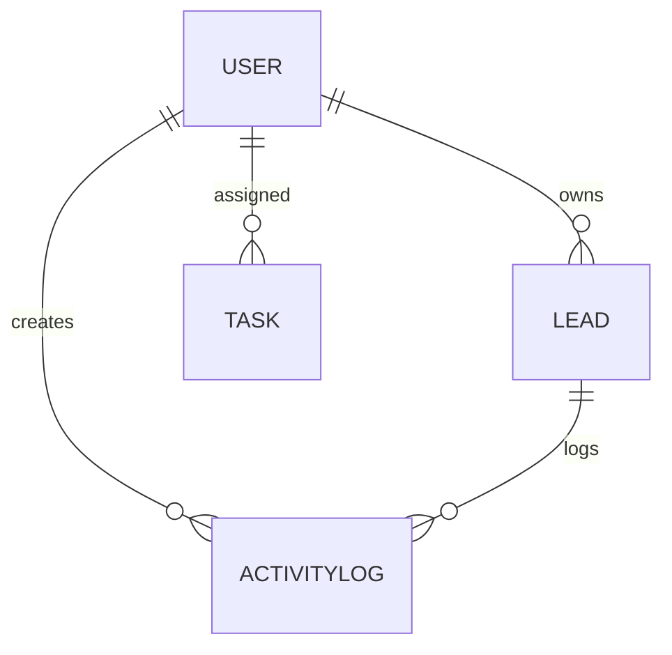

# ER Diagram

```mermaid
erDiagram
  USER ||--o{ LEAD : owns
  USER ||--o{ TASK : assigned
  USER ||--o{ ACTIVITYLOG : creates
  LEAD ||--o{ ACTIVITYLOG : logs
```

The model stays intentionally small so it is easy to explain in interviews.
